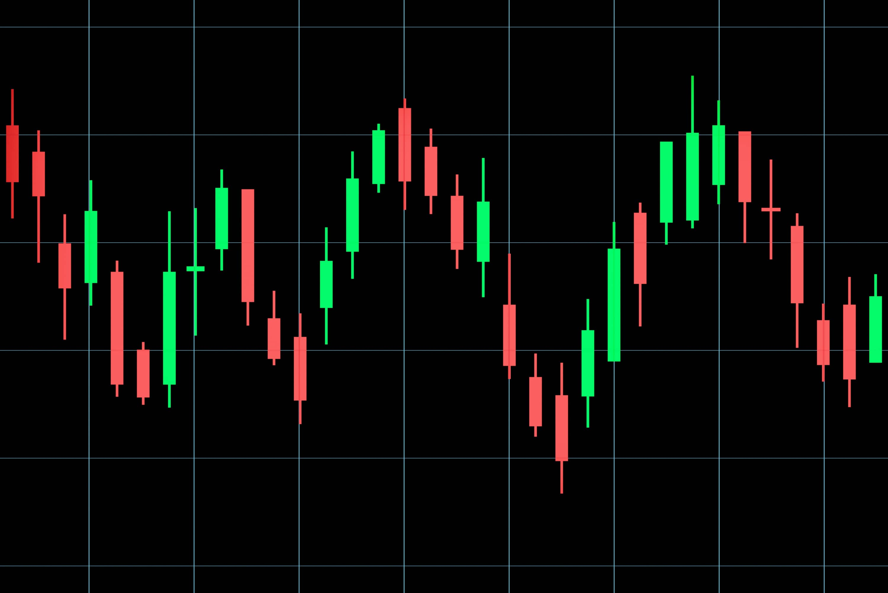
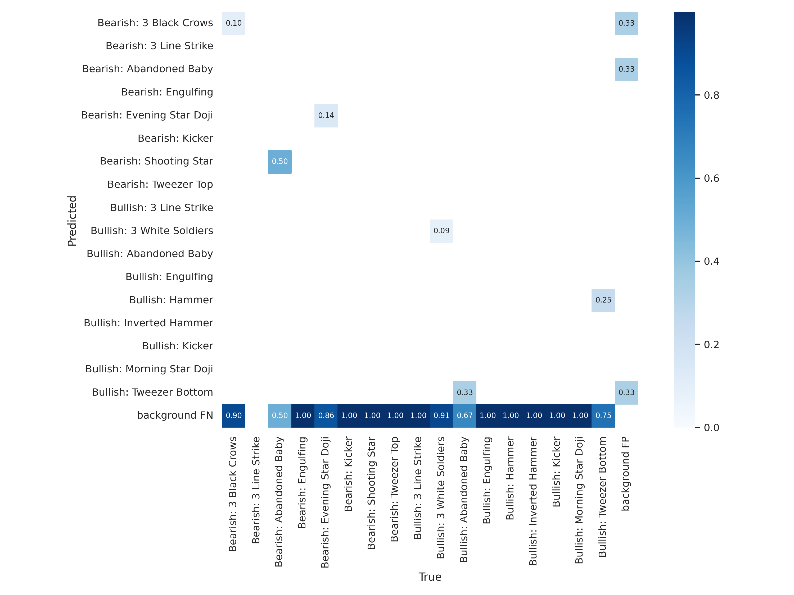

# StockObjects

Brad Blackwood

March 9th 2022

### Summary
* This project aims to create a real time object dectector of candlestick patterns for use when trading stocks.

1. Test if a convelutional neural network will be able to differentiate between patterns with a reasonably small dataset.
2. Test if the YOLO algorithm for object detection will be suitable for detecting stock patterns with a small dataset.
3. Implement a trained model for use in real time as a proof of concept for future endevors. 



### Business Understanding
* In the trading world information is key. Proffesionals typically have the quickest access to information that provides them with a competative advantage. My goal is to create an application to help amature traders compete with the knowledge and expertize of proffesional traders at their fingertips. I believe that sharing this competative advantage with amatures will help to minimize the wealth gap.

Resources for learning about candlestick patterns.

https://www.investopedia.com/trading/candlestick-charting-what-is-it/

https://en.wikipedia.org/wiki/Candlestick_pattern

https://www.alphaexcapital.com/candlestick-patterns/


### Data Understanding
* Working with image classification and object detection the primary source of data used will be images.
* Using supervised learning methods labels must also be provided for use when training models. 
    1. Image classification data folder structure. (folder names act as the labels) Entire image is used as data of the labeled class.  
    ```
    ├── ...
    ├── images
    │   ├── bearish_pin
    │   ├── bullish_pin
    │   ├── evening_star_bearish
    │   ├── morning_star_bullish
    │   ├── three_black_crows_bearish
    │   ├── three_line_strike_bearish
    │   ├── three_line_strike_bullish
    │   └── two_black_gapping_bearish
    ├── testing_images
    │   └── unseen
    └── ...
    ``` 
    2. Object detection data folder structure. (label folders contain text files with yolov5 formatted labels) labels are accompanies by cordinates for bounding boxes that allow for more specific areas for training.
    ```
    ├── ...
    ├── train
    │   ├── images
    │   └── labels
    ├── test
    │   ├── images
    │   └── labels
    └── valid
           ├── images
           └── labels
        
    ```
    
| **Datasets** | Image Classification | Object Detection |
| :----:       | :----:               | :----:           |
| framework    | tensorflow/keras     | pytorch/yolov5   |
| # of images  | 160                  | 150              |
| # of labels  | 160                  | 500              |
| # of classes | 8                    | 17               |

* Limitations of Image Classifier
    1. Classifies any image to 1 of 8 classes. (providing images with a complete list of candlestick classes would be reduce the limitations of the classifier.)
    2. Small dataset size showed relatively good results but was most likely prone to over fitting.
* Limitations of Object Detector
    1. Still working with a small dataset. Training on more images and labels will produce a better real world result. 
    2. Data was only collected from yahoo finance. Detecting patterns on other platforms would pose a problem. This decision was intentional to narrow the scope of use to allow for an increase in performance on a smaller dataset. 

### Data Preparation

* Classifer
    1. Images were collected from google images and screenshots from yahoo finance.
    2. They were then labeled by organizing them into the repository structure shown above.
    
    

    
    
* Detector
    1. Screenshots we taken of various candlestick charts on yahoo finance. (cmd+shift+4 on mac)
    2. .txt files were created as the labels using https://roboflow.com/ 

### Modeling

* Classifer
    1. Modeling was done using tensorflow and keras.
    2. A baseline model was build and trained using tensorflow documentation https://www.tensorflow.org/tutorials/images/classification
    3. Slight tuning of hyperparameters was done based on data understanding and use case.
    

    
    
* Detector
    1. Yolov5 was determined to be the optimal framework for real time object detection.
    2. Simple model training process was emulated from yolov5 documentation.
    3. Improvements were then itteratively made to the dataset. (increasing amount of pictures and labels, increase labeling method, increase lable quality, increase number of classes, changes to image augmentations)
    4. Hyperparameters were tuned to increase model training and performance.
    5. Most large batch training was done on Google Colab with a GPU. (this is highly recomended. Training time was ~100x faster than my local machine.)
    6. Final model weights were saved and transfered to local repository for implimentation. 


### Evaluation

#### Classifier

<table width="100%" border="0">
  <tr>    
  <td></td>
  <td></td>
  <td></td>
  </tr>
  <tr>
  <td> Training: increasing in both training accuracy and validation accuracy.</td>
  <td> Visualizing performance of the validation accuracy. I was currious to see what patterns it was unable to identify correctly and what it was mistaken for (some patterns are very similar)</td>
  <td>Confusion Matrix</td>
  </tr>
</table>

Model accuracy = 92%


*accuracy tested on 26 images, with 8 labels. More images could improve the accuracy and validation confidence.

#### Detector

<table width="100%" border="0">
  <tr>    
  <td></td>
  <td></td>
  <td></td>
  </tr>
  <tr>
  <td> Training: Optomized for mAP. The final model stopped training at 380/500 epochs because It stopped increasing peformance. Model was trained in Google Colab. </td>
  <td> Visualizing performance of the validation accuracy. </td>
  <td>Confusion Matrix: lots of patterns were missed (predicted background but have a labeled pattern). Object detector confused "Bearish: Abandoned Baby" and "Bearish: Shooting Star" which are very similar.</td>
  </tr>
</table>


Model mAP = 0.1

* Model could be improved by more images for training.


### Repository Structure

```
├── Image_Classification
│   ├── Candle_Classifier.ipynb
│   ├── images
│   ├── models
│   └── testing_imgages
├── Obeject_Detection
│   ├── YOLOv5_detect.ipynb
│   ├── YOLOv5_training.ipynb
│   ├── cust_yolo_files
│   ├── custom_trained_weights
│   ├── StockObjects.v1i.yolov5pytorch
│   └── yolov5 (repo is created and used in google colab)
├── Real_Time
│   ├── chromdriver (whatever version of chrome you have)
│   ├── rt_demo.ipynb
│   └── ss.png
├── README.md
├── requirements.txt
└── .gitignore
```
