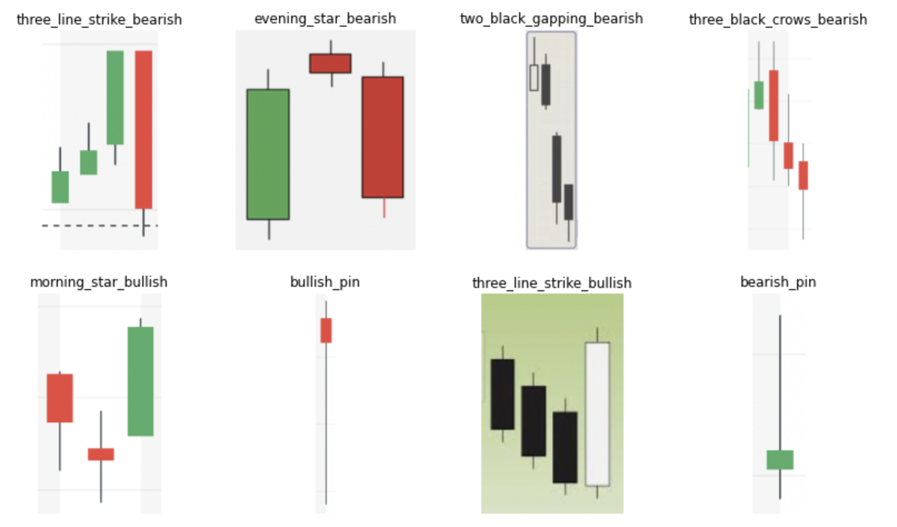

    StockObjects
    
    Brad Blackwood

    2021-03


    Business Understanding:
    
     An "exchange" is a form of market where people can buy and sell stocks, currency, futures, etc. with to goal of making a profit. Trading in volatile markets is ultra-competitive where quick access to information gives a competitive advantage. This advantage is normally described in terms of minimizing risk and maximizing reward. This could mean buying into a stock just as good news breaks or staying away from a stock that is reversing trends. 
    
    Technical Analysis is a field of study and belief that market behaviors can be predicted. Some techniques that are used to interpret stock data (or currency, futures, etc.) include simple methods like a moving average, something more complicated such as the MACD (moving average convergence divergence). Candlesticks are a common way of interpreting financial data and provide more information than a line plot. While a line plot gives a single price point for a set period, a candlestick visually provides an open, low, high, and close price for a set period. This allows the interpreter/analyst to get substantially more information. 
    


    
    Candlesticks have been studied as a way to predict future pricing trends for more than 100 years with their origins going back to Japan where they were used to predict rice prices. Many patterns have emerged that users claim can predict trends with high accuracy and this can be leveraged to make a profit when trading. There are many nuances that take a good eye to identify the patterns well/consistently and it takes a true professional to do quickly.
    
    Using neural networks and computer vision to train models to classify and locate these patterns in real-time would help to level the playing field for amateur traders to compete with professions and minimize the risk-reward disparity. 


    * bullish - optomisitic view of the current stock (ect). Prediciting an increase in price.
    * bearish - pesamistic view of the current stock (ect). Prediciting a decrease in price.


    goals:
    
    Image classification vs Object detection 
    - classification refers to the computers ability to read an entire image and assign it a class. 
    - detection refers to the computers ability to locate an object or class within an image.
    
    1. use tensorflow/keras to classify images of candlestick pattern. 
    
    2. train a yolo algorithm for object detection.
    
    3. implement custom trained yolo object detection in real time.
    
    While the intention of this project is to indentify future trends using candlesticks, all performance metrics used will be based on the models accuracy and other metrics to correctly identify the labeled patterns/classes that the model is trained on and not on the vailidity of the trading stategy.


    data:
    
    Without a readily available dataset for this task and as I am not a trained profesional, I refered to various online resources to help me identify/collect/and label patterns. I used both google images and candle charts from yahoo finance to collect screenshots of PNG files to use as input data for training the nueral networks.
    


    
    Classifier preparation:
    
    Detector preparation:

#### methods

    Candlestick Classifier
    
    What are candlesticks?
    
    Candlesticks are a visualization tool for trading in financial markets. They provide information about the open, low, high, and close prices over a set period. Since the invention of candlesticks in the 1800's Japanese candlestick patterns has been studied to make predictions about future price actions. Depending on the source there are between 30-100 recognized patterns with an association with the current market sentiment as well as some predictors about price. Candlestick patterns range in complexity and the nuance that typically takes an expert to identify quickly.
    
    What is Image Classification?
    
    Image classification is a technique of assigning some class/label to an image. Machine learning/neural networks are a common way to train and implement a classification model. In this notebook, I will show how to create a simple classification model using TensorFlow and show its performance.
    

    
    The file structure is important when working with image classification as it is what determines the labels for each image. 
    
```
├── ...
├── images
│   ├── bearish_pin
│   ├── bullish_pin
│   ├── evening_star_bearish
│   ├── morning_star_bullish
│   ├── three_black_crows_bearish
│   ├── three_line_strike_bearish
│   ├── three_line_strike_bullish
│   └── two_black_gapping_bearish
├── testing_images
│   └── unseen
└── ...
``` 
    I have 2 folders that contain images 1. images and 2. testing_images. The images folder contains subfolders of the classes I am to identify, in their respective subfolder are ~20 images per class that will be used for training and validation. In the testing_images folder, there are completely unseen images by the model that don’t contain any labels attached to them. Keeping a batch of images separate that can be used as an additional validation step is important to verify that the modeling process doesn't contain significant data leakage.


``` maybe remove becasue it repeats whats above
Visualizing each pattern that is in our samples.

bullish and bearish sub-labels were added to be able to further help classify the sentiment/trend prediction.

Bullish = Positive outlook, predicting an increase in price.

Bearish = Negative outlook, predicting a decrease in price.


Other terms that are useful when describing candles are...

Body - The section between the Open and Close price.
     - Green/White candles signify an increase in price from open to close
     - Red/Black candles signify a decrease in price from open to close

Wick - The section between the High and Low prices and the body.
```    
    
    
    Pin - have a short body with long wicks. If the body is towards the top of the candle signifies a bullish sentiment and vice-versa. 
    
    Morning/evening star - a 3 candle pattern that has a gap between the close and open prices adjacent to the middle candle. The middle candle has a relatively small body. The direction of the third candle is what determines the direction of the new trend. 
    
    Three-line strike - a 4 candle pattern where the body of the 4th candle is longer than the previous 3 candles and moves in the opposite direction. 
    
    Two black gap - typically a 4 candle pattern where two bearish candles follow a reversal with a sizable gap between the 2nd and 3rd candle. 
    
    Three black crows - A reversal pattern that consists of 3 bearish candles where the 1st candle of the reversal has a longer body than the last bullish/green/white candle. The following candles have lower opens and closes than the previous candle.
    
    * These are brief descriptions of my interpretations of the patterns. 
    
    resources:
https://www.investopedia.com/trading/candlestick-charting-what-is-it/

https://en.wikipedia.org/wiki/Candlestick_pattern

https://www.alphaexcapital.com/candlestick-patterns/


    Model accuracy = 0.92% (this ranges depending on training 0.88-0.92)
    *accuracy tested on 26 images, with 7 labels. More images could improve the accuracy and validation confidence.
    *model is determined to be sufficient proof of concept with useable results when classifying candlestick patterns with a reasonable amount of hand-labeled images.